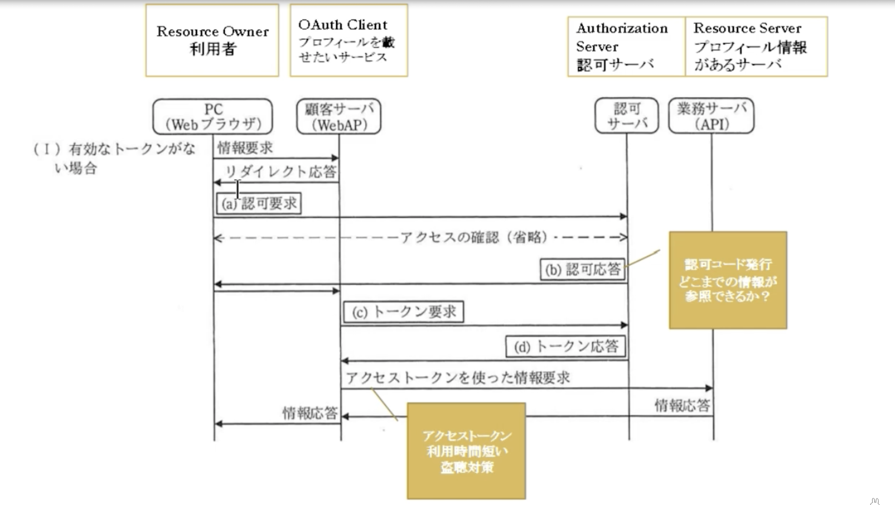

## 認証と認可
### 認証と認可をどうやってハッキングしていくか?   
#### 認証フロー 
### OAuth2.0(Open Authorization)
複数のWebサービスを連携して動作させるために使われる仕組み  
本来Webサービスを利用するためは、サービス毎にユーザーIDとパスワードを入力して認証する  
OAuthを利用すると個別にIDやパスワードを入力することなく、アプリケーション間の連動ができる

|        構成要素        |      解説      |
|:-------------------|:--------------------|
| Resource Owner | クライアントPC(リソースのアクセス権限を持っている) |  
| OAuth Client | 利用者が使用するサービス |  
| Authorization Server | 認可サーバ. アクセストークは発行する |  
| Resource Server | リソースを保持しているサーバ. 他のWEBサービスから接続するためのAPIがある |  

|        トークン種類        |      解説      |      有効期限      |
|:-------------------|:--------------------|:--------------------|
| アクセストークン | 通常のトークン | 短い |  
| リフレッシュトークン | アクセストークンの有効期限が過ぎると利用される | 長い |  

#### 例) APIアクセスの通信シーケンス図(有効なトークンが無い場合)
  

#### 認証ってなんなの?  
・認証とは「通信の相手が誰（何）であるかを確認すること」  
認証の3要素
コンピュータの世界も含め、現実世界で「認証」を行うための要素には以下の3つ  

WHAT YOU ARE (inherence factor)
 

顔貌、声、指紋、署名など、その人自身を提示して、相手にアイデンティティを確認させる方法.
小さなコミュニティではお互いの顔や声を相互に知っているため、面と向かえば相手が誰かはわかる. つまり「認証が完了する」ということです.
 

WHAT YOU HAVE (possession factor)
  

身分証、携帯電話等、その人だけが持っているものを提示することによって認証する.
 
ある程度コミュニティが大きくなってくると、お互いの特徴を覚えきれなくなった場合は身分証明書を提示して、相手を認証する

また、その身分証には顔写真がプリントしてあることも多く、結果として WYA に依存するものも少なくない.
   

WHAT YOU KNOW (knowledge factor)
   

パスワード、秘密の質問等、その人だけが知っていることを提示して認証する

コンピュータの世界で最も多く使われるファクター

  
一般的に、上記3つのうちいずれか1つを満たすことで、認証が完了することが多い. しかし、より確実な認証を行いたい場合は、Multi-Factor Authentication (MFA) という考え方で、複数のファクターを確認することもある

#### 認証系の攻撃とその対策について  

辞書攻撃
  
ユーザーが一般的な単語と短いパスワードを使用する傾向があるという事実を利用する攻撃。ハッカーは一般的な単語のリスト(辞書)を使用して、多くの場合、単語の前後に数字を付けて、企業のアカウントに対してユーザー名ごとにそれらの攻撃を試みる(ユーザー名は一般的に社員の名前に基づいているため、判別するのは非常に簡単)

総当たり攻撃
   
プログラムを使用して、ありそうなパスワードまたはランダムな文字セットを生成する. この攻撃は、Password123のようなわかりやすい脆弱なパスワードから始まり、被害はそこから広まります. このような攻撃を実行するプログラムは、通常、大文字と小文字のバリエーションも含めて試みる. 

トラフィック妨害
   
サイバー犯はパケットスニファなどのソフトウェアを使用して、ネットワークトラフィックを監視し、通過したパスワードをキャプチャする. 電話回線の盗聴や傍受と同様に、ソフトウェアで重要な情報を監視およびキャプチャ. パスワードなどの情報が暗号化されていない場合、容易にキャプチャできてしまう. また、使用する暗号化方式の強度によっては暗号化された情報であっても解読できる場合アリ

中間者攻撃
   
ハッカーのプログラムは、渡される情報を監視するだけでなく、通常はWebサイトまたはアプリになりすまして、通信している両者の間に積極的に割り込む. これにより、プログラムはユーザーの信用情報や口座番号、社会保障番号といった機密情報を取得できるようになる. 中間者(MITM)攻撃は、ユーザーを偽のサイトに誘導するソーシャルエンジニアリング攻撃によってしばしば悪用される. 

キーロガー攻撃
  
サイバー犯は、ユーザーのキーストロークを追跡するソフトウェアをインストールして、アカウントのユーザー名やパスワードだけでなく、ユーザーが認証情報でログインしていたWebサイトまたはアプリを正確に収集できる. このタイプの攻撃では通常、最初に悪意のあるキーロガーソフトウェアをユーザーのマシンにインストールさせる別の攻撃の餌食になる

ソーシャルエンジニアリング攻撃
   

ユーザーから情報を取得するための幅広い方法.
  

フィッシング：信用情報の提供、悪意のあるソフトウェアをインストールするためのリンクのクリック、または偽のWebサイトへのアクセスをユーザーに促すメールやテキストなど
 

スピアフィッシング：フィッシングに似ているが、ユーザーについて既に収集された情報に依存する、より巧みに作成された、カスタマイズされたメール/テキストを使用する. たとえば、ハッカーは、ユーザーが特定の種類の保険口座を持っていることを把握してそれをメールで参照したり、企業のロゴやレイアウトを使用して正当なメールを装うこともある
    

ベイティング ：攻撃者は、感染したUSBまたはその他のデバイスを、社員が拾って使用するよう、公共または雇用主の場所に置く.

Quid pro quo ：ヘルプデスクの社員などになりすまし、ユーザーから情報を取得する必要がある方法でユーザーと通信する.

  

#### パスワード攻撃の阻止方法

1.強力なパスワードを設定する
  
覚えやすい/推測しにくいパスワードを推奨. 大文字と小文字、数字、特殊文字の適切な組み合わせが役立つ. できれば、一般的な単語や一般的なフレーズの使用は避ける. サイト固有の単語(パスワードでログインしているアプリの名前など)は絶対に避けてください. (既知の脆弱なパスワードの辞書に含まれていないか、パスワードをチェックすることを推奨)

2.社員の教育
   
ソーシャルエンジニアリングの戦術に対する最善の防御策の1つは、ハッカーが使用する技術とその認識方法をユーザーに伝えること  
しかし、強力なパスワードや教育だけでは十分ではない！  
サイバー犯は、コンピューティング能力を使用することで、高度なプログラムを実行し、膨大な数の信用情報を取得または試行することができる. 企業はシングルサインオン(SSO)や多要素認証(MFA)などのツール(2要素認証とも呼ばれる)を採用する必要がある
 

3.SSO(Single Sign-On)認証

従業員が1組の信用情報ですべてのアプリとサイトにログインできるようにすることで、パスワードを排除(ユーザーに必要なことは、強力なパスワードを1つ覚えるだけ). MFAでは、OneLogin Protectなどのアプリケーションによって生成されたPINや指紋認証など、ユーザーがログインするときに追加の情報が必要. (※この追加情報により、サイバー犯がユーザーになりすますことは、はるかに困難になる)
  

#### Man in the middle（MITM）攻撃  
主にユーザーとサービスの間にサイバー犯罪者が入り込み、受け渡すデータを盗み見たり改ざんしたりする攻撃手法のこと  
※オンラインバンキングを狙ったMITM攻撃は、Webブラウザーの通信に割り込んで攻撃を行うため、「MITB（Man in the Browser）攻撃」とも呼ばれる

MITB攻撃の場合は、フィッシングメールによって偽のオンラインバンキングサービスに誘導したり、バンキングマルウェアに感染させたりする方法がある。フィッシングメールで偽サイトに誘導するケースでは、だまされたユーザーがフィッシングサイトにアクセスした際に、サイバー犯罪者がユーザーのWebブラウザーとオンラインバンキングサービスの間に入り、入力されたデータを不正に中継する。

オンラインバンキングを狙った攻撃では、ユーザーがオンラインバンキングサービスで送金する際に、送金先や送金金額を勝手に書き換えてしまう。銀行側では改ざんした内容で送金作業を行い、ユーザー側には本来の送金作業が正しく行われたかのようなデータを返す。バンキングマルウェアの場合は、日本でも感染被害が多かった「Ursnif（アースニフ）」では、感染したパソコンのユーザーがオンラインバンキングサービスにアクセスしたことを検知し、Webブラウザーで送受信されるデータを入手して不正アクセスを行ったり、改ざんして不正送金に悪用したりする。  

### セッションと攻撃方法  

セッションとは
  

セッションとはWebサービスやWebアプリケーションにログインしてからログアウトするまでの一連の手続きのこと

通常、WebサービスやWebアプリケーションを動かすWebサーバーとユーザーの関係は、1対多の関係であり、Webサーバーから見るとユーザー１人ひとりは識別していない。しかし、ユーザーごとに提供するページや情報が異なる場合は、Webサーバーはユーザーを識別する必要がある

その際にセッションを使ってユーザーを識別している. ユーザーにログインIDとパスワードを確認することで識別し、識別したユーザーだけに提供する情報を渡すためにセッションが用いられる. Webサーバーは、非常に多くのユーザーと通信を行うため、識別したユーザーだけに渡す情報に印をつけることで、お互いに正しい情報を受け渡しすることが可能. その際に利用されるものが「セッションID」
  

#### 攻撃方法

セッションID固定化攻撃
  

正規ユーザー（あなた）のセッションIDを乗っ取り、正規ユーザーになりすます攻撃手法
  

正規ユーザーは、Webサービスにログインする際にセッションIDを発行するが、そのセッションIDを事前に用意して、正規ユーザーに使わせることによってセッションの乗っ取りが行われる. セッションの乗っ取りによってあなたになりすますことで、次に挙げるような被害を受ける可能性アリ

・クレジットカード番号の盗み出し

・ネットショッピングサイトなどで無断の買い物をする

・他ユーザーへの迷惑行為

・犯罪行為

ネットショッピングサイトを利用するなかで、クレジットカード番号などを登録している人も多い. 我々になりすますことで、それらの情報が盗み出せるようになり、無断で買い物することも可能となる.

SNSなどのコミュニティにおいては、他のユーザーへの迷惑行為や犯罪予告などが、あなたになりすましておこなわれるため、あなた自身の社会的信用の失墜に繋がる可能性アリ

  

### CORS(オリジン間リソース共有)について  
「同一生成元ポリシー (Same-Origin Policy)」というポリシーによって設けられた制限を緩めるもの 

#### 同一生成元ポリシー (Same-Origin Policy)

同一生成元ポリシーとは？
JavaScript で自由にやりとりできるところは、その JavaScript をとってきたところと同一の場所だけに制限する
  

フロントエンドでは、別の場所にあるデータを表示したいことがよくある. このデータを表示する前に、ブラウザはまずデータを取得するためにサーバーにリクエストしなければならない. クライアントは、サーバーにデータを送り返すためにサーバーが必要とするすべての情報を含むHTTPリクエストを送信する  

例1) サーバー（api.mywebsite.com）からユーザー情報をサイト（www.mywebsite.com）に取得しようとしているとします。  
  
サーバーにHTTPリクエストを送っただけで、リクエストしたJSONデータが返ってくる

例2)まったく同じリクエストを別ドメインで試してみる
(www.anotherdomain.comにあるサイトからリクエストを行う)
  
デフォルトでは、リクエストのオリジンと同じオリジン（same origin）にあるリソースにしかアクセスできない→Error  
リソースが異なる（サブ）ドメイン、プロトコル、ポートにある場合、そのリソースはクロスオリジン（cross origin）になる

#### Q. もし、「同一生成元ポリシー」が存在しなかったら....
例) Facebookで送ってきたウィルスリンクを誤ってクリックしてしまった場合、このリンクは銀行サイトをロードするiframeが埋め込まれた「悪質なサイト」にリダイレクトし、設定されたクッキーによって正常にログインできてしまう  

この「悪質なサイト」の運営者は銀行サイトのDOMコンテンツを操作して、あなたに代わって自分の口座に送金することが可能
  

##### 同一生成元ポリシーは、同じオリジン（same origin）からのリソースにのみアクセスできるようにするため例2)を防ぐことができる  
  
上記の場合、オリジンのwww.evilwebsite.comがwww.bank.comからクロスオリジンのリソースにアクセスしようとしています。しかし、同一生成元ポリシーがこれを阻止し、悪質なサイトの運営者がわたし達の銀行データにアクセスできないようにしてくれる!
