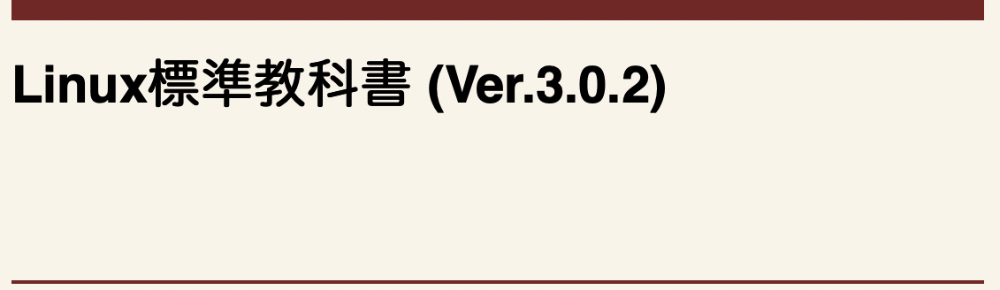

担任: 堀江先生
# 第2部 インフラ概要・操作(Linux)
氏名：21卒_山本敏之  
参考図書：Linux標準教科書(ver.3.0.2)  
 
## 1章：Linuxとは
ソフトウェア：ハードウェア上で動作しているプログラム  
　↓２種類ある  
**基本ソフトウェア**   
→基本ソフトウェアは応用ソフトウェアが動作する際に必要な「部品」を提供したり、ハードウェアという「資源」を管理する  
例)OSのこと、Windows , Linux , MacOSX etc..


**応用ソフトウェア**  
→基本ソフトウェア上で動くアプリケーション  
例) Word , Excel , PowerPoint etc..  
### OS(Operating System)の役割
1. さまざまな応用ソフトウェアが使用するであろう共通部品を提供する  
→各応用ソフトウェアが多様な機能(メニュー,ツールバーアイコン,確認メッセージ)を用意すると作成に負担がかかるため
2. コンピュータが提供できる機能を管理する  
→基本ソフトウェア(OS)が、各種ソフトウェアを非常に短いタイミングで切り替えているから
本来なら同時に1つのことしか処理できないにもかかわらず、ワープロや表計算の基本ソフトウェアを同時に動かすことができる  

### Linuxについて  
→カーネルとユーザランドによって成り立つ

#### パッケージを使って応用ソフトウェアを導入する利点  

応用ソフトウェアをLinux上で実行する際の時間と手間を省くため  
→パッケージとはLinuxに対して追加機能を提供するもので、従来はソースをダウンロードして自らビルドする必要があった  
↓  
ディストリビューター(必要で複雑なプログラムをまとめ、簡単な手順でインストールできるようにしてくれる人<団体>)の手によってパッケージが作られるようになった  

**※パッケージマネージャー**  
→パッケージを簡単にインストールしたり、アップデートするモノ  
→今日のLinuxディストリビューションには何らかのパッケージマネージャーが必ず用意されており、インターネットに接続されていれば最新のパッケージをパッケージを導入/更新することが容易になった  

## 3章 基本的なコマンド1
実際に手を動かしてみた！  
↓  
感想：「実際にファイルやディレクトリを操作できている！」  

#### 【テスト】  
Q1. ファイルやディレクトリを参照するコマンド  
A. ``ls``

Q2. /media/cdromの中身を最新更新日順に並べて表現するコマンド  
A. ``ls -lt /media/cdrom``  

Q3. 今いるパスを表示するコマンド  
A. ``echo $PATH ``  

Q4. /home/userフォルダにあるtestというファイルを/root/backupフォルダに移動させるコマンド  
A.
```
{ mv } /home/user/test /root/backup  
{ ls -l } /root/backup   
total 4  
drwxr-xr-x@ 12 toshiyukiyamamoto  staff  384  7  4 17:35 docker_container
…..
```  

Q5. パス/etcの中のファイルでファイル名の一部に「resolv」という文字列が含まれているファイルを検索するコマンド  
A. ``ls *resolv 」(ワイルドカード”＊”を使用する)``


## 4章 正規表現とパイプ

### **パイプ**
```
ls -l /usr/bin | less
….
…
..
.
: q  ←「q」で一覧表示を終了
```


### グレップ grep  
(global regular expression print)：  
〜ファイル全体からファイル全体から/正規表現に一致する行を/表示する〜  

#### 【テスト】
Q1. grepコマンドを利用し、行頭がaまたはbで始まる行を抽出できる正規表現を以下の4つから選びなさい  
A: ``4.grep -e ^[ab]``  

Q2. 「ls /usr/bin | grep -e ^a..$」というコマンドを実行した場合、どのような結果になるか答えよ  
A: ``/usr/bin ファイル内のaで始まり、aと行末の間に２文字入っている文字列を出力する``  

Q3. パス/etcの中にあるファイルでファイル名がconfで終わるものをgrepとパイプを用いて記述しなさい  
A: ``ls /etc | grep -e $conf``  

Q4. ls -lを実行した結果をls-resultファイルに書き込む場合のコマンドを記述しなさい  
A: ``ls-l > ~ls-result``  

Q5. chkconfig --listの実行結果からiptablesだけを取り込んで表示するコマンドをgrepを使って記述しなさい  
A: ``chkconfig --list | grep iptables``


## 5章 基本的なコマンド2  
#### 【テスト】
Q1. sortコマンドの実行結果となるように、適切なオプションを付けなさい。  
```
% sort (   -k  3   ) price
Digital Camera 9800
32-inch TV 49800
Blue-ray Recorder 59800
```
Q2. uniq-sampleというファイルに対してuniqコマンドを実行したときの実行結果を答えなさい  
```
% cat uniq-sample
red
red
blue
red
blue
```
A.  
```
red
blue
red
blue
```  

Q3. file1とfile2の内容の違いを比較するコマンドを記述しなさい。  
A. ``% diff file1 file2``  

Q4. 以下のコマンドを実行したところ、何も結果が表示されずコマンド待ち状態になりました。何が考えられるか答えなさい。
```
$ diff test1 test2
$  
```
A. ``file1とfile2 の内容が同じ可能性がある``

Q5. パス /etcのlsコマンドの実行結果が保存されたファイルls-etcの終わり8行分を表示する場合のコマンドを記述しなさい  
```
$ ( tail -n 8  ) ls-etc
wpa_supplicant
xdg
xinetd.d
xml
yp.conf
yum
yum.conf
yum.repos.d
```
## 6章：vi エディタ  
#### 【テスト】  
Q1. カレント行から3行をコピーする  
A. 3yy  

Q2. 文書内のabcという語句を検索する  
A. /abc  

Q3. 編集中のファイルを保存せずに強制終了する  
A. :q!  

Q4. 文書の100行目に移動する  
A. 100G  

Q5. 文書中の「高野豆腐」を「絹ごし豆腐」に置換する。ただしgオプションを付けて実行する。  
A. :%s/高野豆腐/絹ごし豆腐/g  

## 7章：管理者の仕事  
#### 【テスト】  
Q1. useraddでuserを作りましたが、ログインすることができません。ログインできるようにするには何が必要か答えなさい    
A. ``passwdコマンドでパスワードを登録する``  

Q2. ユーザuser2を削除する場合のコマンドを答えなさい    
A. ``userdel user2``  

Q3. グループpenguinを作成する場合のコマンドを答えなさい    
A. ``groupadd penguin``  

Q4. すでに作成済みのユーザpenguinのパスワードを変更する場合のコマンドを答えなさい    
A. ``passwd penguin``  

Q5. suコマンドに-オプションを付けない場合と付ける場合の違いは何か、答えなさい    
A.   
  ・オプションを付けない場合：カレントディレクトリを変更せずにrootでログインする  
  ・オプションを付ける場合：カレントディレクトリをrootのホームディレクトリに変更してログインする    

## 8章：ユーザ権限とアクセス権  
### umaskアクセス早見表
|  umask値  | ディレクトリのデフォルトアクセス権 | ファイルのデフォルトアクセス権 |
|:--|:---|:-----|
| 0 | rwx | rw- |
| 1 | rw- | rw- |
| 2 | r-x | r-- |
| 3 | r-- | r-- |
| 4 | -wx | -w- |
| 5 | -w- | -w- |
| 6 | --x | --- |
| 7 | --- | --- |
#### 【テスト】  
Q1. 以下のコマンドを実行した場合の実行結果を選びなさい  
```
# umask 022
# touch test
# chgrp nobody test
# ls -l test
```  
A. ``3.-rw-r--r--. 1 root nobody 18 5月 29 18:51 2012 test``  
　┗マスク値を変更  
　　testファイルを作成  
　　testファイルのグループをnobodyに変更  
　　"test"でソートしてLong形式で出力  

Q2. chownfileのファイルモードを755にするためのコマンドを記述しなさい。  
A. ``chmod 755 chownfile``  

Q3. chownfileのファイルモードを644にするためのコマンドを記述しなさい。  
A. ``chmod 644 chownfile``  

Q4. umask 070にした後umaskファイルを作成した場合に設定されるファイルモードは以下のどれでしょうか？  
A. ``1. -rw----rw-. 1 user user 0 5月 29 19:22 2012 umask``

Q5. umask 022にした後umaskファイルを作成した場合に設定されるファイルモードは以下のどれでしょうか？  
A. ``4. -rw-r--r--. 1 user user 0 5月 29 19:24 2012 umask``  

## 9章：シェルスクリプト
#### 【テスト】  
Q1. 実行結果が解になるように、変数"LPI"に入力した値を出力しなさい  
```
// Answer
$ LPI = linux
$ echo ( $LPI )
linux 
```  
Q2. 以下のスクリプトの空欄を埋め、カレントディレクトリにファイル lpi.txt が存在しているか確認するスクリプトを完成させなさい  
```
// Answer
#!/bin/bash
if [ -f lpi.txt ]; then
  echo file exists.
(else)
  echo file does not exists.
(if)
```  
Q3. 以下のスクリプトの空欄を埋め、カレントディレクトリ内のすべてのファイル（サブディレクトリを除く）の種類を表示するスクリプトを完成させなさい  
```
// Answer
#!/bin/bash
for i in `ls`
do
  if [ ! -d $i ]; then
    file $i
  fi
(done) 
```  
Q4. 次の動作をするシェルスクリプトを書きなさい  
1. 実行すると、age: としての年齢の入力を促される  
2. 20以上の値を入れると'you can drink.'と出力される  
3. 20未満の値を入れると'you cannot drink.'と出力される  
```
// Answer
#!/bin/bash
echo -n age:; read age
if [ $age -ge 20 ]; then
  echo "you can drink."
else
  echo "you cannot drink."
if
```
Q5. bashで、シェルスクリプトの中身を表示しながら実行（デバッグ）するにはどのようにしたらよいか答えなさい  
A. ``[sh -x]コマンドでシェルスクリプトを実行する``

