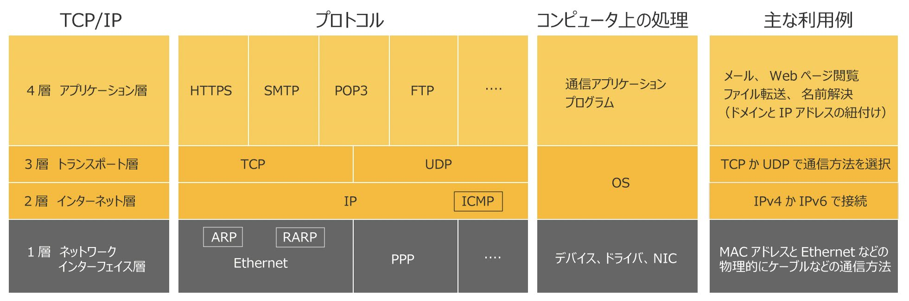
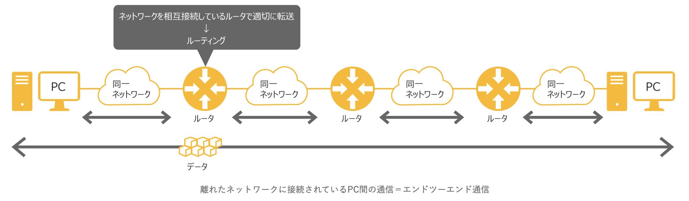
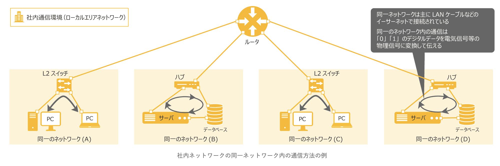
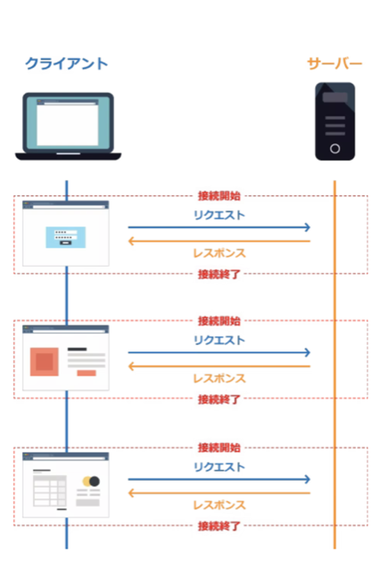
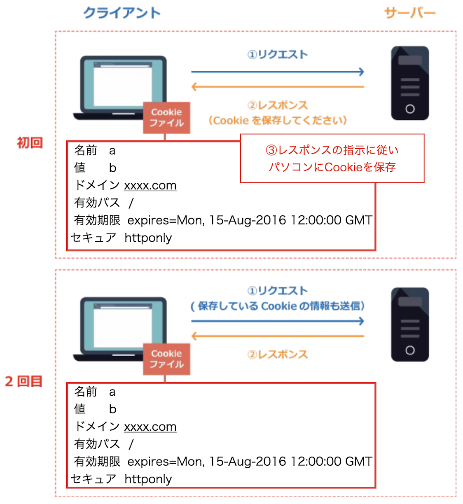

# 認証を支えるネットワーク技術
  

### 目次  
 - TCP/IP  
 - cookie
 - セッション  
 - Webstorage  

## はじめに
<details><summary>認証とは？</summary>   
<p>通信の相手が誰（何）であるかを確認すること</p></details>  

## TCP/IP
<details><summary>TCP/IPとは？</summary>   
<p>コンピュータネットワークにおいて、世界標準的に利用されている通信規則。機器やOSが異なっても共通のプロトコルを用いて通信を成立させるもの</p></details>  
<details><summary>TCP(Transmission Control Protocol)</summary>
<p>送ったデータが相手に届いたか、その都度確認しながら通信するやり方</p>
<p>正確な信号を送信する通信の規格を定めたもの</p>
</details>  
<details><summary>IP(Internet Protocol)</summary>
<p>IPアドレスと呼ばれる数値を付与しその数字を用いて通信先の指定及び呼び出しを行いネットワーク通信を行うこと</p>
</details>  
  
### TCP/IPプロトコル通信のネットワークアーキテクチャ
  

<details><summary>4層 アプリケーション層</summary>   
<p>アプリケーションで扱うデータのフォーマットや手順を決める役割</p>
<p>アプリケーションは基本的には人間が扱うため、文字や画像など人間が認識できるようにデータを表現</p>
<p>主要プロトコル：「HTTP」「SMTP」「POP3」「IMAP4」「DHCP」「DNS」</p>
</details>  
<details><summary>3層 トランスポート層</summary>   
<p>データを適切なアプリケーションに振り分ける役割</p>
<p>最下層からトランスポート層まで正しく機能すると、送信元と宛先のアプリケーション間でデータの送受信ができるようになる</p>
<p>主要プロトコル：TCP , UDP</p>
</details>  
<details><summary>2層 インターネット層</summary>   
<p>複数のネットワーク間のデータ転送を行う役割</p>
<p>ネットワークはたくさんのネットワークが存在し、そこに色々な機器を接続していることで実現</p>
<p>主要プロトコル：「IP」「ICMP」「ARP」</p>
<p>「ルータ」：多数のネットワーク同士を接続してデータ転送を行う</p>  
<p>「ルーティング」：ルータによるネットワーク間のデータ転送</p> 
<p>「エンドツーエンド通信」：ネットワーク間のデータ転送</p>
</details> 

  

<details><summary>1層 ネットワークインターフェイス層</summary>   
<p>同一のネットワーク内でデータを転送する役割</p>
<p>例)ルータやレイヤ3スイッチで区切られる範囲 or レイヤ2スイッチで構成する範囲</p>
<p>主要プロトコル：有線の「Ethernet（イーサーネット）」, 無線LAN（Wi-Fi) , PPP</p>
</details>  
  
  

## Cookie（クッキー）  
<details><summary>Cookieとは？</summary>   
<p>正式名称：HTTP Cookie</p>
<p>WebサーバアプリケーションがWebブラウザに対し特定の情報を保持させておく仕組み</p>
</details>  

### Cookieの役割  
HTTPは一往復(リクエストし→レスポンスする)で通信が切断される  

  

そのため、サーバーは以前の状態を全く覚えていない!(前のページからの続き？/関連したアクセス? etc..) => ステートレス(stateless)  
しかし、以前の状態を覚えていないとネットショッピングのような商品を購入できるWebサイトは作れない  
>ネットショッピングをするのにログインし、商品をカートに入れ、購入します</p>
ページ遷移するたびに通信は切断されている.サーバーは、誰がカートに入れ、購入したのかを全く覚えていない</p>
これでは、非常に困る💦  

状態を保持する(ステートフル)ために**Cookie**を使用し、サーバーがクライアントに対して識別できる一意の値を渡し、クライアントはリクエストする時にその値を教えてあげれば、サーバー側で識別できるようになり、それぞれの状態を覚えることができる  

サーバーからのレスポンスメッセージに「Cookieを保存してください」という指示があれば、クライアントは指示に従いCookieを保存する  
クライアントにCookieが保存されていれば、クライアントは常にリクエストメッセージに「このようなCookieがあります」とサーバーに教える仕組みになっている  

  
  
サーバーは、レスポンスメッセージに**Set-Cookie**ヘッダを付与することで、クライアントに対して「Cookieを保存してください」と指示することが可能  
**Set-Cookie**ヘッダには、Cookieの有効期限やCookieを送るドメイン、有効パスなどの各属性があり「 ; 」で区切って記述することで設定が可能  
```
// レスポンスメッセージ（Set-Cookieヘッダの構文）
Set-Cookie: 名前=値;[expires=有効期間(日時)];[Path=URL相対パス];[Domain=ドメイン名];[secure];[httponly]
```  
```
// レスポンスメッセージ（Set-Cookieヘッダの記述例）
Set-Cookie: a=b; expires=Mon, 15-Aug-2016 12:00:00 GMT; path=/; domain=xxxx.com; secure; httponly
```  
**Set-Cookie**ヘッダの内容に従い、クライアントはCookieを保存する
逆にクライアントは、リクエストメッセージに**Cookie**ヘッダを付与することで、サーバーに対して「このようなCookieが保存されています」と教えることができる
Cookieが存在する限り、常にリクエストメッセージに**Cookie**ヘッダを付与します  
```
// リクエストメッセージ（Cookieヘッダの構文）
Cookie: 名前=値
```  
```
// リクエストメッセージ（Cookieヘッダの記述例）
Cookie: a=ba
```

 - Cookieによって各ユーザが閲覧するWebページの内容をカスタマイズすることなどが出来る.  
 - WebブラウザでWebサービスにアクセスをする際にログインをして利用する場合がありますが、事前にログインをしているときとログインが必要な場合があるが、これはサーバがログイン情報を記憶しているのではなくクライアントマシンのWebブラウザのCookieに記憶されており、以前にログインしたことあるサイトであればIDとパスワードの情報を同時に送信しているので自動的にログインが出来ていることなる.  
 - CookieはHTTPリクエストヘッダに格納されておりサーバに送信されます.  
  
## セッション  
<details><summary>セッションとは？</summary>   
<p>コンピュータネットワーク用語で、一連の通信のこと</p>
<p>接続を確立してから切断するまでが一つのセッション</p></details> 
HTTPのセッションは「セッションID」を使って同一のセッションを管理する  
セッションIDはHTTP cookieに保存してHTTPヘッダに格納して送受信したり、URLに埋め込んでGETPメソッドで送受信したりする.  

### セッションの管理  
例) ネットショッピング  
ネットショッピングの場合、ログインし・商品をカートに入れ・購入 まで一連の処理（セッション）として扱いたいが、HTTPはステートレスのため、一連の処理（セッション）として扱うことができない...  
⬇︎そこで  
**Cookieを利用して、一連の処理（セッション）として扱う.**  
 - Cookieに一意の値を入れ、リクエストするときにCookieにある値も一緒に送ってもらうことで識別可能になり、一連の処理として扱えるようになる  
 - Cookieを利用することで、セッション管理が可能に

### PHPでセッションを管理 
PHPでセッションを開始するには**session_start()**関数を使用する  
```
session_start();
```  
session_start()を記述することで、自動でセッションIDを発行してくれる！
<details><summary>セッションIDとは？</summary>  
<p>一意の値の役割をする</p>
<p>セッションを管理するために、Cookieに一意の値を入れて、リクエストしてもらうことで、一連の処理として扱える</p>
</details>  
セッションIDを発行する際は、セッションIDごとにセッションファイルを作成し、サーバーに保存される  
→作成されたセッションファイルには任意の値を入れることができる  

***session_start()は、リクエストメッセージにセッションIDがあるのか/ないのかで挙動が変わる***  

#### リクエストメッセージにセッションIDがある場合  
 - セッションIDがあれば、該当するセッションファイルにある情報を参照する  
#### リクエストメッセージにセッションIDがない場合  
 - セッションIDがなければ、セッションIDを発行し、セッションIDをCookieに保存するようにレスポンスメッセージを送信する  
 - セッションIDを発行する際に、サーバー側では、セッションIDごとにセッションファイルを作成する  
  
  


https://www.ipa.go.jp/security/awareness/administrator/secure-web/chap6/6_session-1.html  
https://qiita.com/7968/items/ce03feb17c8eaa6e4672
  


## Web Storage  
クライアント側にデータをローカル環境に記録するための仕組み  

#### Web StorageとCookieとの比較
|                |      有効期限      |      データ量      | サーバーへのデータ送信 | 操作 |
|:-------------------|:--------------------|:--------------------|:-------|:----
| LocalStorage | 永続的に有効 | ドメインに対して5MB~10MB | データ利用時のみ | Javascript
| SessionStorage | ウィンドウ・タブを閉じるまで | ドメインに対して5MB~10MB | データ利用時のみ | Javascript
| Cookie | ウィンドウ・タブを閉じるまでor任意設定まで | 4KB |  リクエスト毎に自動送信 | サーバー側の言語(PHPなど)
  
### Web StorageとCookieを比べてみて...  
 - ユーザー情報を保存するにはCookie(サーバー側の言語で書かれることが多い)  
 - Cookieはサーバアクセスするたびに自動送信するのでセキュリティは低い？  
 - Cookieは膨大なデータは扱い辛い(サーバが同じコンピュータに対して発行できるCookieの数が20個)  
 - Webstorageはサーバとの通信が発生しない(WebStorageとはブラウザにデータを保存しておく為の仕組み)  
 - Cookieはwebstorageより有効期限を自由に設定できる
 - Webstorageの魅力的な保存容量  
 - Webstorageは[個人情報レベルの貴重情報]の保存には適さない  
 →クロスサイトスクリプティング（XSS）などの対策をしていないとデータを盗まれる可能性アリ  


https://developer.mozilla.org/ja/docs/Web/API/Web_Storage_API

